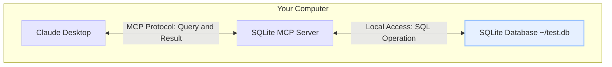

# MCP

## 개요

- Model Context Protocol(MCP)
- AI 모델과 외부 도구, 데이터 소스 간의 통신을 표준화하는 오픈소스 프로토콜
- 2024년 11월 Anthropic에서 처음 제안 및 공개
- AI 시스템이 외부 세계와 효과적으로 상호작용할 수 있도록 설계
- **오픈 거버넌스 이관**: 지속 가능한 오픈소스 생태계를 위해 **Linux Foundation (Agentic AI Foundation)**에 기부 및 이관되어 운영

## 주요 특징

- **표준화된 통신**: AI 모델과 외부 서비스 간의 통신 방식을 표준화
- **도구 확장성**: 새로운 도구와 기능을 쉽게 AI 시스템에 통합 가능
- **컨텍스트 관리**: 대화 컨텍스트를 효율적으로 관리하여 AI의 이해도 향상
- **멀티모달 지원**: 텍스트뿐만 아니라 이미지, 오디오 등 다양한 형태의 데이터 처리 지원
- **MCP Registry (공식 서버 카탈로그)**: 서버 중앙 검색 및 인덱싱을 지원하는 공식 MCP Registry 시스템 도입
- **MCP Apps (UI 인터랙션 지원)**: 텍스트/JSON 기반 도구 호출을 넘어 대화창 내 양식, 폼, 데이터 시각화 등 Rich UI를 직접 렌더링할 수 있는 **MCP Apps / mcp-ui** 확장 스펙 지원

## 작동 방식

MCP 주요 구성 요소:

1. **MCP 서버**: 외부 도구와 서비스를 호스팅하고 관리하는 서버
2. **MCP 클라이언트**: AI 모델이 MCP 서버와 통신하기 위한 인터페이스
3. **도구 정의**: 각 도구의 기능, 파라미터, 반환 값 등을 정의하는 스키마

```
AI 모델 <-> MCP 클라이언트 <-> MCP 서버 <-> 외부 도구/서비스
```

## 사용 사례

- **웹 브라우징**: AI가 실시간으로 웹 페이지를 검색하고 정보를 추출
- **데이터 분석**: 외부 데이터베이스나 API에서 데이터를 가져와 분석
- **코드 실행**: 사용자가 제공한 코드를 안전한 환경에서 실행하고 결과 반환
- **IoT 제어**: 스마트홈 기기 등 IoT 장치와 상호작용

## 구현 예시

### 기본 MCP 서버 구현 (Node.js)

```javascript
const express = require('express');
const app = express();
app.use(express.json());

// 도구 정의
const tools = {
  calculator: {
    add: (a, b) => a + b,
    subtract: (a, b) => a - b,
    multiply: (a, b) => a * b,
    divide: (a, b) => a / b
  },
  weather: {
    getTemperature: (city) => {
      // 실제 구현에서는 날씨 API 호출
      return `${city}의 현재 온도는 22°C입니다.`;
    }
  }
};

// MCP 엔드포인트
app.post('/mcp', (req, res) => {
  const { tool, method, params } = req.body;
  
  if (!tools[tool] || !tools[tool][method]) {
    return res.status(400).json({ error: '유효하지 않은 도구 또는 메서드' });
  }
  
  try {
    const result = tools[tool][method](...params);
    res.json({ result });
  } catch (error) {
    res.status(500).json({ error: error.message });
  }
});

app.listen(3000, () => {
  console.log('MCP 서버가 포트 3000에서 실행 중입니다.');
});
```

### Python에서의 MCP 클라이언트 예시

```python
import requests
import json

class MCPClient:
    def __init__(self, server_url):
        self.server_url = server_url
        
    def call_tool(self, tool, method, params):
        payload = {
            "tool": tool,
            "method": method,
            "params": params
        }
        
        response = requests.post(
            f"{self.server_url}/mcp", 
            json=payload
        )
        
        if response.status_code == 200:
            return response.json()["result"]
        else:
            error = response.json().get("error", "알 수 없는 오류")
            raise Exception(f"MCP 호출 실패: {error}")

# 사용 예시
client = MCPClient("http://localhost:3000")
result = client.call_tool("calculator", "add", [5, 3])
print(f"5 + 3 = {result}")  # 출력: 5 + 3 = 8

weather = client.call_tool("weather", "getTemperature", ["서울"])
print(weather)  # 출력: 서울의 현재 온도는 22°C입니다.
```

## MCP 다이어그램 예시



## AI 모델 및 생태계 통합 (IDE / 도구)

주요 AI 대형 모델 및 코딩 에디터/IDE들이 MCP를 핵심 표준으로 공식 채택하여 연동을 지원하고 있습니다.

### 주요 AI 모델 및 서비스 지원
- **Claude (Anthropic)**: MCP를 최초 발표하였으며 기본적으로 완벽한 연동 지원
- **OpenAI (ChatGPT)**: ChatGPT Desktop, API 등에서 MCP 표준을 공식 채택(Adoption)하여 직접 연동 지원
- **Google (Gemini)**: DeepMind Gemini 모델 및 플랫폼에서 MCP 표준을 공식 채택하여 연동 지원

### 개발 도구 및 IDE 통합
- **Claude Desktop**, **Cursor**, **Windsurf**, **VS Code**, **JetBrains** 등 주요 AI 코딩 에디터, IDE 및 에이전트 도구들이 MCP 생태계를 핵심 인터페이스 표준으로 적극 채택

## 보안 고려사항

MCP를 구현할 때 고려해야 할 주요 보안 사항:

- **인증 및 권한 부여**: MCP 서버에 대한 접근 제어
- **입력 검증**: 모든 사용자 입력 및 AI 요청에 대한 철저한 검증
- **샌드박싱**: 코드 실행 등의 위험한 작업은 격리된 환경에서 수행
- **속도 제한**: 과도한 API 호출 방지를 위한 속도 제한 구현

## MCP 서버 탐색 및 주요 레퍼런스

개별 MCP 서버 및 유틸리티는 생태계 변화가 빠르게 일어나므로, 최신 서버 검색 및 탐색은 공식/대표 카탈로그 레지스트리를 활용하는 것이 좋습니다.

### 1. 대표 레퍼런스 서버 (Official Reference Servers)

가장 대표적이고 표준으로 사용되는 연동 예시 서버들입니다.

- **filesystem**: 로컬 파일 시스템 읽기/쓰기 및 디렉토리 접근
- **git / github**: Git 저장소 작업, Issue/PR 조회 및 버전 관리 연동
- **postgres / sqlite**: 데이터베이스 연결, 스키마 탐색 및 SQL 쿼리 실행
- **fetch / puppeteer**: 웹 컨텐츠 수집, 스크래핑 및 브라우저 자동화 제어

### 2. 공식 및 대표 카탈로그

- **[MCP Registry](https://github.com/modelcontextprotocol/registry)**: 공식 MCP 서버 인덱스 및 중앙 패키지 검색
- **[Awesome MCP Servers](https://github.com/modelcontextprotocol/servers)**: 커뮤니티에서 검증된 오픈소스 MCP 서버 모음집
- **[Glama.ai MCP Directory](https://glama.ai/mcp/servers)**: 웹 기반 MCP 서버 검색 및 탐색 플랫폼

## 참고 자료

- [Model Context Protocol 공식 사이트](https://modelcontextprotocol.io)
- [Anthropic MCP 안내 문서](https://www.anthropic.com/news/model-context-protocol)
- [MCP GitHub 조직 레포지토리](https://github.com/modelcontextprotocol)
